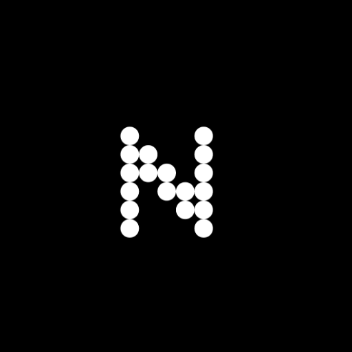

# 🎬 Neo Movies

<div align="center">
  
  <p><strong>Современный онлайн-сервис с удобным интерфейсом</strong></p>
</div>

## 📋 О проекте

Neo Movies - это современная веб-платформа построенная с использованием передовых технологий. Проект предлагает удобный интерфейс, быструю навигацию и множество функций для комфортного просмотра информации об фильмах и сералах а также стороние плееры предоставляемые видео-балансерами.

### ✨ Основные возможности

- 🎥 Три встроенных видеоплеера на выбор (Alloha, Lumex, HDVB)
- 🔍 Умный поиск по фильмам
- 📱 Адаптивный дизайн для всех устройств
- 🌙 Темная тема
- 👤 Система авторизации и профили пользователей
- ❤️ Возможность добавлять фильмы в избранное
- ⚡ Быстрая загрузка и оптимизированная производительность

## 🛠 Технологии

- **Frontend:**
  - Vite
  - React
  - TypeScript
  - Material UI
  - JWT-based authentication (custom)

- **Backend:**
  - GOOOLANG (neomovies-api)
  - MongoDB (native driver)

## Начало работы

1. Клонируйте репозиторий:
```bash
git clone https://gitlab.com/foxixus/neomovies-web.git
cd neomovies-web
```

2. Установите зависимости:
```bash
npm install
```

3. Создайте файл `.env` и добавьте следующие переменные:
```env
VITE_API_URL=https://api.neomovies.ru
```


4. **Запустите проект:**
```bash
# Режим разработки
npm run dev

# Сборка для продакшена
npm run build
npm start
```
Приложение будет доступно по адресу [http://localhost:4173](http://localhost:4173)

## API (neomovies-api)

Приложение использует отдельный API сервер. API предоставляет следующие возможности:

- Поиск фильмов и сериалов
- Получение детальной информации о фильме/сериале
- Оптимизированная загрузка изображений
- Кэширование запросов

---

## 👥 Авторы

- **Frontend Developer** - [Erno](https://gitlab.com/foxixus)

## 📄 Лицензия

Этот проект распространяется под лицензией Apache-2.0. Подробности в файле [LICENSE](LICENSE).

## 🤝 Участие в проекте

Мы приветствуем любой вклад в развитие проекта! Если у вас есть предложения по улучшению:

1. Форкните репозиторий
2. Создайте ветку для ваших изменений
3. Внесите изменения
4. Отправьте pull request


## Благодарности

- [KinopoiskApiUnofficial](kinopoiskapiunofficial.tech) за предоставление API
- [Vercel](https://vercel.com/) за хостинг API

## 📞 Контакты

Если у вас возникли вопросы или предложения, свяжитесь с нами:
- Email: neo.movies.mail@gmail.com
- Matrix: @foxixus:matrix.org

---

# ⚖ Юридическая информация / Legal Information

**NeoMovies** — это проект с открытым исходным кодом, целью которого является предоставление информации о фильмах и сериалах на основе TMDB. Мы **не храним**, **не распространяем** и **не размещаем** какие-либо видеоматериалы. Видеоконтент отображается через сторонние плееры, предоставляемые внешними балансерами, к которым сайт лишь предоставляет интерфейс доступа.

## 🛡️ Мы не несем ответственности

Мы не контролируем содержимое, предоставляемое сторонними плеерами. Все действия, связанные с просмотром или скачиванием контента, полностью лежат на пользователе.

Пользователи должны сами убедиться в соответствии использования сайта законодательству своей страны.

---

## 📚 Законодательство о защите авторских прав

Ниже приведены ссылки на законы и нормативные акты разных стран:

- 🇺🇸 [DMCA — Digital Millennium Copyright Act](https://www.copyright.gov/legislation/dmca.pdf) — США
- 🇪🇺 [Directive 2001/29/EC (InfoSoc)](https://eur-lex.europa.eu/legal-content/EN/TXT/?uri=CELEX:32001L0029) — Европейский Союз
- 🇩🇪 [Urheberrechtsgesetz (UrhG)](https://www.gesetze-im-internet.de/urhg/) — Германия
- 🇫🇷 [Code de la propriété intellectuelle](https://www.legifrance.gouv.fr/codes/id/LEGITEXT000006069414/) — Франция
- 🇷🇺 [Гражданский кодекс РФ, часть IV](http://www.consultant.ru/document/cons_doc_LAW_64629/) — Россия
- 🇯🇵 [Japanese Copyright Act](https://www.cric.or.jp/english/clj/) — Япония
- 🌐 [WIPO Copyright Treaty](https://www.wipo.int/treaties/en/ip/wct/) — Всемирная организация интеллектуальной собственности

---

# ⚖ Legal Information (English)

**NeoMovies** is an open-source project that provides movie and TV show metadata using TMDB. We **do not host**, **store**, or **distribute** any video content. Media is streamed using third-party players served by external balancers, which we merely link to.

## 🛡️ Disclaimer of Liability

We do not control the content provided by external players. Any viewing or downloading of media is the user’s sole responsibility.

Users are advised to verify whether use of the site complies with their local copyright laws.

---

## 📚 Copyright Laws by Country

- 🇺🇸 [DMCA - U.S. Copyright Law](https://www.copyright.gov/legislation/dmca.pdf)
- 🇪🇺 [EU Directive 2001/29/EC](https://eur-lex.europa.eu/legal-content/EN/TXT/?uri=CELEX:32001L0029)
- 🇩🇪 [German Copyright Act (UrhG)](https://www.gesetze-im-internet.de/urhg/)
- 🇫🇷 [French Intellectual Property Code](https://www.legifrance.gouv.fr/codes/id/LEGITEXT000006069414/)
- 🇷🇺 [Russian Civil Code Part IV](http://www.consultant.ru/document/cons_doc_LAW_64629/)
- 🇯🇵 [Japanese Copyright Law](https://www.cric.or.jp/english/clj/)
- 🌐 [WIPO Copyright Treaty](https://www.wipo.int/treaties/en/ip/wct/)

---

<div align="center">
  <p>Made with <3 by Ernela</p>
</div>
